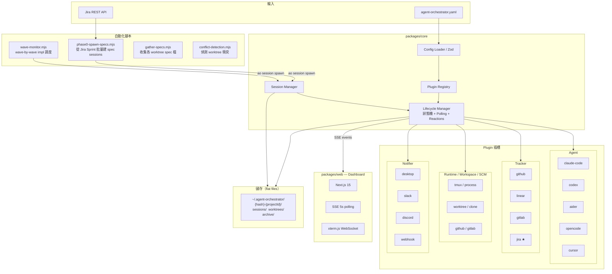
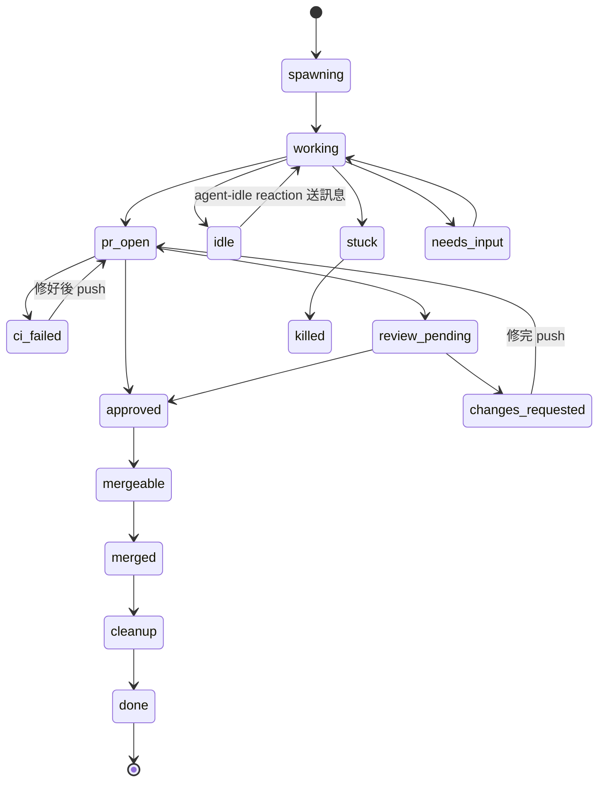
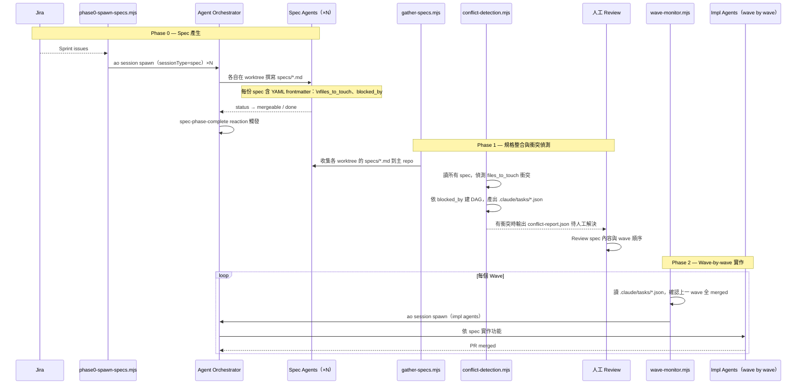

# Agent Orchestrator — Fork

這是 [ComposioHQ/agent-orchestrator](https://github.com/ComposioHQ/agent-orchestrator) 的 fork。

原版是一個平行 AI Coding Agent 管理平台：每個 agent 在獨立 git worktree 中執行，自動處理 CI 修復、回應 Review 意見、開 PR，並提供單一 Dashboard 統一監控。安裝、設定、基本用法請直接參閱[上游 README](https://github.com/ComposioHQ/agent-orchestrator#readme)。

本 fork 在此基礎上加入了 **Jira Server 整合**與 **Spec-Phase 兩階段 Pipeline**，用於對接 Jira Sprint、自動批量產生 spec sessions，再 wave-by-wave 調度 impl agents。

---

## 與上游的差異

**新增 Plugin**

| Plugin | 說明 |
|--------|------|
| `tracker-jira` | Jira Server REST API v2，支援 Sprint 篩選與 `--sprint` 參數 |

**Core 修改**

| 檔案 | 修改內容 |
|------|---------|
| `types.ts` | `SessionSpawnConfig` / `SessionMetadata` 新增 `sessionType` 欄位；`ReactionConfig.action` 新增 `"command"` 類型 |
| `config.ts` | Zod schema 同步 `"command"` action |
| `metadata.ts` | 將 `sessionType` 寫入 session flat-file metadata |
| `session-manager.ts` | spawn 時標記 Jira issue 為 `agent:in-progress`；將 `sessionType` 傳入 `buildPrompt` |
| `lifecycle-manager.ts` | PR 開啟時同步 PR 連結到 Jira（`agent:in-review` label）；新增 `spec-phase-complete` reaction 觸發邏輯；`"command"` action 透過 `child_process.exec` 執行 shell 指令 |
| `prompt-builder.ts` | 新增 `BASE_SPEC_PROMPT`；`sessionType=spec` 的 session 跳過 agentRules 與 PR workflow prompt |

**CLI 修改**

| 檔案 | 修改內容 |
|------|---------|
| `cli/src/commands/spawn.ts` | 新增 `--session-type` flag |

**Web 修改**

| 檔案 | 修改內容 |
|------|---------|
| `web/server/tmux-utils.ts` | `resolveTmuxSession` 支援 `<hash>-<project>-<sessionId>` 格式（修正 dashboard terminal 空白） |

**自動化腳本（`scripts/`）**

| 腳本 | 說明 |
|------|------|
| `phase0-spawn-specs.mjs` | 從 Jira Sprint 批量產生 spec sessions |
| `gather-specs.mjs` | 收集各 worktree 的 `specs/*.md` 到主 repo |
| `conflict-detection.mjs` | 偵測 `files_to_touch` 衝突、建 DAG wave 順序、輸出 `.claude/tasks/*.json` |
| `wave-monitor.mjs` | 讀 `.claude/tasks/*.json`，wave-by-wave 調度 impl agents |
| `jira-sprint-watcher.mjs` | 監控 Jira Sprint 狀態，自動觸發下一波 |

---

## 系統架構



---

## Session 狀態機



自動 Reactions（可在 `agent-orchestrator.yaml` 覆寫）：

| 事件 | 預設行為 |
|------|---------|
| `ci-failed` | 自動送訊息給 agent，最多重試 2 次 |
| `changes-requested` | 自動送訊息，30 分鐘後 escalate |
| `merge-conflicts` | 自動送訊息，15 分鐘後 escalate |
| `agent-idle` | 自動送訊息，最多重試 2 次 |
| `agent-stuck` / `needs-input` | 發送緊急通知 |
| `all-complete` | 通知 + 摘要 |
| `spec-phase-complete` ★ | 所有 spec sessions 完成時觸發，可接 spawn impl wave |

---

## Spec-Phase Pipeline（本 fork 自訂工作流程）

三階段架構：spec 撰寫 → 規格整合與衝突偵測 → wave-by-wave impl 實作。



### 使用方式

**Phase 0：從 Jira Sprint 批量產生 spec sessions**

```bash
export JIRA_EMAIL=you@company.com
export JIRA_TOKEN=your-api-token

node scripts/phase0-spawn-specs.mjs \
  --jira-project MOPFREQ \
  --jira-url https://jira.yourcompany.com \
  --ao-project your-project \
  --sprint current      # current（預設）| all | "<sprint 名稱>"
```

**Phase 1：收集 spec、偵測衝突、產出 wave 計畫**

```bash
# 1. 把各 worktree 的 specs/*.md 收到主 repo
node scripts/gather-specs.mjs --repo-path ~/your-project

# 2. 偵測檔案衝突、建 DAG wave 順序、輸出 .claude/tasks/*.json
#    有衝突時產出 specs/conflict-report.json，需人工修正 spec 再重跑
node scripts/conflict-detection.mjs
```

有衝突時，修改衝突 spec 的 `files_to_touch` 或用 `blocked_by` 設定串行順序，再重跑 `conflict-detection.mjs`。

**Phase 2：wave-by-wave impl 調度**

```bash
node scripts/wave-monitor.mjs \
  --ao-project your-project \
  --repo-path ~/your-project \
  --agent arcforge \
  --interval-ms 30000
```

---

## 開發

```bash
pnpm install && pnpm build   # 安裝與編譯
pnpm test                    # 執行測試
pnpm dev                     # 啟動 web dashboard dev server
pnpm typecheck               # 全套型別檢查
```

核心檔案：

| 檔案 | 用途 |
|------|------|
| `packages/core/src/types.ts` | 所有 plugin 介面定義 |
| `packages/core/src/lifecycle-manager.ts` | 狀態機 + polling + reactions |
| `packages/core/src/session-manager.ts` | Session CRUD |
| `packages/plugins/tracker-jira/` | Jira plugin |
| `scripts/` | Spec-Phase Pipeline 腳本 |

---

## License

MIT — 同上游專案。
