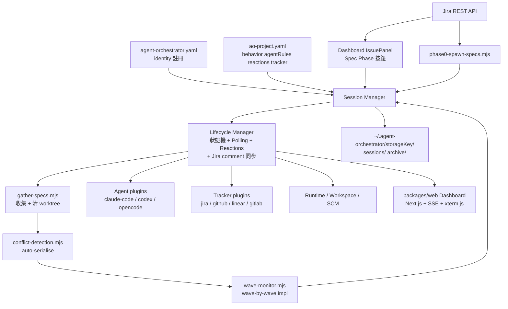
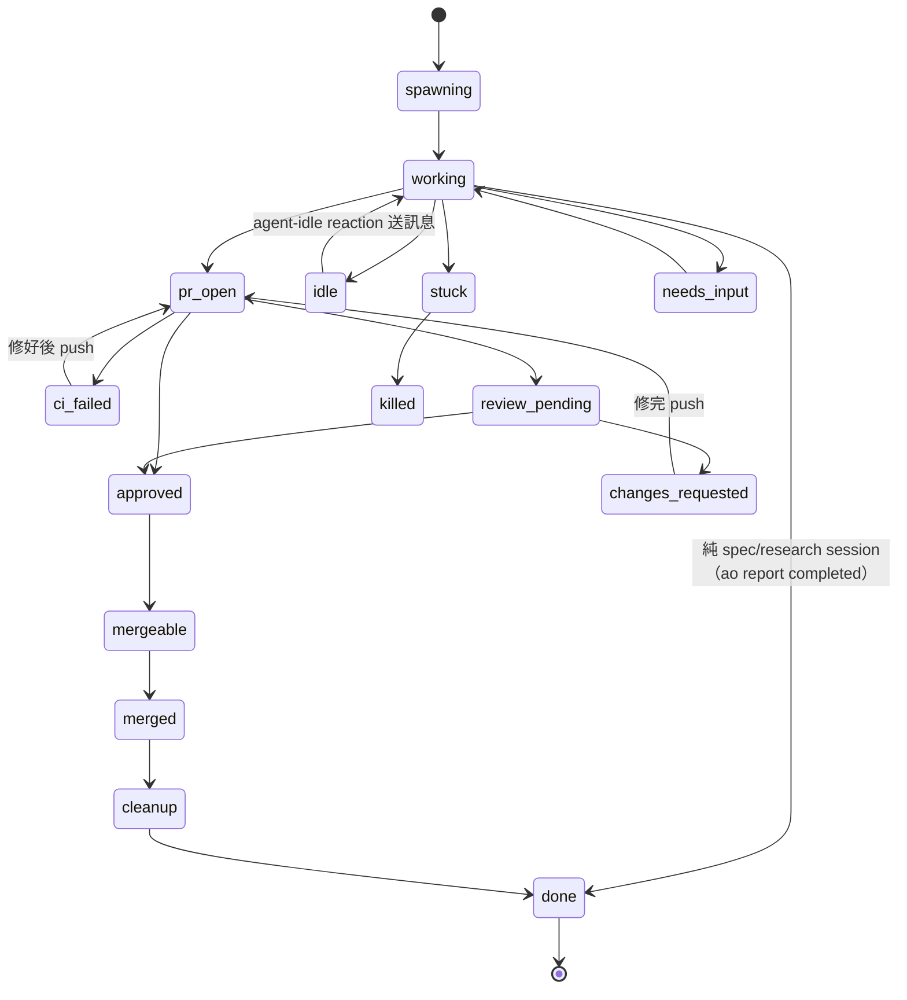
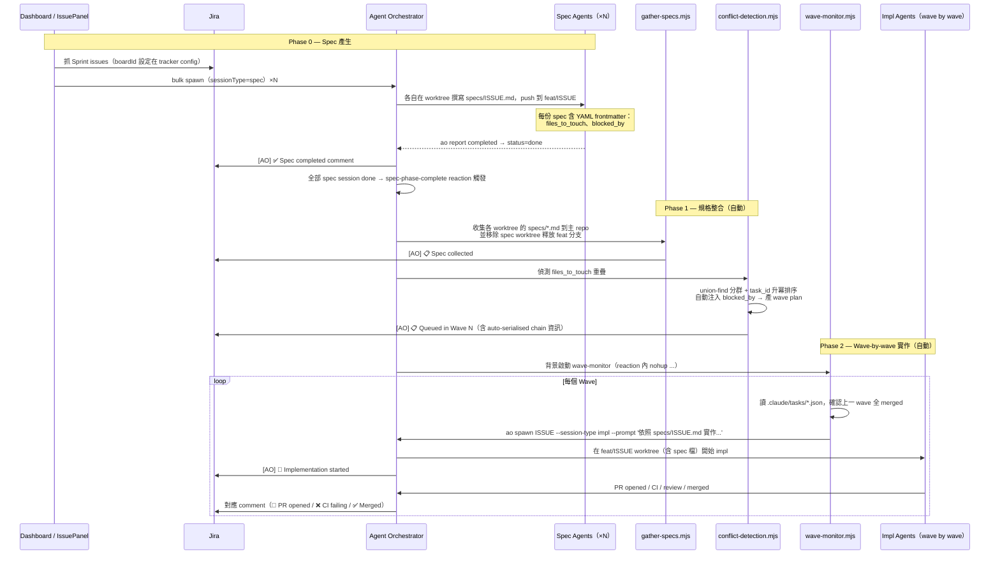

# Agent Orchestrator — Fork

這是 [ComposioHQ/agent-orchestrator](https://github.com/ComposioHQ/agent-orchestrator) 的 fork。

原版是一個平行 AI Coding Agent 管理平台：每個 agent 在獨立 git worktree 中執行，自動處理 CI 修復、回應 Review 意見、開 PR，並提供單一 Dashboard 統一監控。安裝、設定、基本用法請直接參閱[上游 README](https://github.com/ComposioHQ/agent-orchestrator#readme)。

本 fork 在此基礎上加入了 **Jira Server 整合**、**Spec-Phase 三階段 Pipeline**，並把整套流程串成全自動：從 dashboard 點一下「Spec Phase」就會走完 spec 撰寫 → 衝突偵測 → wave-by-wave impl → 每個狀態同步回 Jira。

---

## 與上游的差異

**新增 Plugin**

| Plugin | 說明 |
|--------|------|
| `tracker-jira` | Jira Server REST API v2，支援 Sprint 篩選、`addComment` 介面（Tracker 介面新增） |

**Core 修改**

| 檔案 | 修改內容 |
|------|---------|
| `types.ts` | `SessionSpawnConfig` / `SessionMetadata` 新增 `sessionType` 欄位；`ReactionConfig.action` 新增 `"command"` 類型；`Tracker` 介面新增 `addComment?` |
| `config.ts` | Zod schema 同步 `"command"` action；`repo` 接受 string 或 `{owner,name,platform,originUrl}` object |
| `metadata.ts` | 將 `sessionType` 寫入 session flat-file metadata |
| `global-config.ts` | `LOCAL_CONFIG_FILENAMES` 加入 `ao-project.yaml`，讓 self-host project 的 global yaml + local yaml 可同目錄共存 |
| `agent-report.ts` | `completed` 從 `idle` 改為 `done`（terminal state，才會觸發 spec-phase-complete reaction） |
| `session-manager.ts` | spawn 時依 `sessionType` 寫 phase comment（🔍 Spec / 🔧 Impl）回 Jira |
| `lifecycle-manager.ts` | PR open / merged / ci_failed / changes_requested / done 自動同步 comment 到 Jira；以 `trackerNotifiedStatus` metadata + 跨 process file lock 做 dedup；`spec-phase-complete` reaction 從 project-level 找；orchestrator 排除在 active sessions 計算外 |
| `prompt-builder.ts` | 新增 `BASE_SPEC_PROMPT`；`sessionType=spec` 的 session 跳過 agentRules 與 PR workflow prompt |

**CLI 修改**

| 檔案 | 修改內容 |
|------|---------|
| `cli/src/commands/spawn.ts` | 新增 `--session-type` flag |
| `cli/src/commands/report.ts` | 各狀態 (`completed` / `needs_input` / `pr_created` / `ci_failed` / ...) 自動回寫對應 Jira comment |

**Web 修改**

| 檔案 | 修改內容 |
|------|---------|
| `web/server/tmux-utils.ts` | `resolveTmuxSession` 支援 `<hash>-<project>-<sessionId>` 格式（修正 dashboard terminal 空白） |
| `web/server/start-all.ts` | Next.js 子程序改用 `node --require silence-rejection.js` 啟動，避免 SSE controller-closed 暫態錯誤把整個程序拖垮 |
| `web/server/silence-rejection.ts` | preload script — 在 next-server 啟動前 install `unhandledRejection` handler |
| `web/src/instrumentation.ts` | Next.js instrumentation — 同樣的 unhandledRejection guard，覆蓋 webhook 等其他 entry |
| `web/src/lib/services.ts` | 註冊 `tracker-jira` plugin；**拿掉 web 端 LifecycleManager 的自動 polling**（CLI 那個 in-process worker 是唯一定期 poller，避免雙 polling 重複觸發 reactions） |
| `web/src/app/api/spawn/route.ts` | 接受並透傳 `sessionType`；spec session 自動載入 `prompts/spec-agent.md` |
| `web/src/app/api/issues/[issueKey]/comment/route.ts` | 新增 — 提供腳本（gather-specs / conflict-detection）回寫 Jira 的 endpoint |
| `web/src/app/api/events/route.ts` | 各 SSE enqueue 點包 try/catch；setInterval / IIFE 補 `.catch()` |
| `web/src/components/IssuePanel.tsx` | Sprint filter 按鈕、checkbox 全選、**Spec Phase 批量按鈕**（送 `sessionType: "spec"` + 自動載入 spec prompt） |
| `web/src/components/SessionCard.tsx` + `globals.css` | working session 顯示旋轉 `working` pill，比左邊小綠 dot 明顯 |

**新增資源**

| 路徑 | 說明 |
|------|------|
| `ao-project.yaml` | 本 repo 自身被 orchestrate 時的 behavior config（agentRules / reactions / tracker），跟 global yaml 同目錄共存 |
| `prompts/spec-agent.md` | Spec agent 的 system prompt，被 `phase0-spawn-specs.mjs` 與 `/api/spawn`（spec mode）自動載入 |
| `packages/web/src/instrumentation.ts` | Next.js instrumentation hook |
| `packages/web/server/silence-rejection.ts` | next 子程序的 preload script |

**自動化腳本（`scripts/`）**

| 腳本 | 說明 |
|------|------|
| `phase0-spawn-specs.mjs` | 從 Jira Sprint 批量產生 spec sessions（CLI 模式；UI 模式請用 dashboard 的「Spec Phase」按鈕） |
| `gather-specs.mjs` | 收集各 worktree 的 `specs/*.md` 到主 repo，**收完自動移除 spec session 的 worktree** 釋放 `feat/<ISSUE>` 分支給 impl agent |
| `conflict-detection.mjs` | 偵測 `files_to_touch` 重疊時 **不再 abort**，自動 union-find 分群 + 升冪排序注入 `blocked_by`，產出 wave plan；衝突細節寫到 `conflict-report.json` 作 audit log |
| `wave-monitor.mjs` | 讀 `.claude/tasks/*.json`，wave-by-wave 調度 impl agents（`ao spawn ... --session-type impl`） |

---

## 系統架構



---

## Self-Host 架構

從 fork 的某次重構開始，**本 repo（agent-orchestrator）自己被當作被 orchestrate 的 project**（self-hosting）。原本的 demo project 已棄用，配置只剩兩個 yaml：

| 檔案 | 角色 | 內容 |
|------|------|------|
| `agent-orchestrator.yaml` | **Global identity registry** | `port`、`defaults`、`projects` map（每個 project 的 `path` / `repo` / `storageKey` / `displayName` / `sessionPrefix`） |
| `ao-project.yaml` | **Local behavior config** | `agentRules`、`orchestratorRules`、`reactions`、`tracker` 等（被 AO 在 project 目錄底下尋找） |

兩個檔案同目錄並存的關鍵是 fork 改的 `LOCAL_CONFIG_FILENAMES`：local config 除了傳統的 `agent-orchestrator.yaml`，還會找 `ao-project.yaml`。Global yaml 的內容會被 AO 在啟動時 sanitize，自動 strip 掉非 identity 欄位（如果你誤把 `agentRules` 寫到 global yaml，啟動時會看到 `[ao] stripped N legacy project registry fields`）。

啟動時設環境變數：
```bash
# ~/.zshrc
export AO_GLOBAL_CONFIG=~/projects/agent-orchestrator/agent-orchestrator.yaml
ao start
```

---

## Session 狀態機



自動 Reactions（可在 `ao-project.yaml` 的 `reactions:` 區塊覆寫）：

| 事件 | 預設行為 |
|------|---------|
| `ci-failed` | 自動送訊息給 agent，最多重試 2 次 |
| `changes-requested` | 自動送訊息，30 分鐘後 escalate |
| `merge-conflicts` | 自動送訊息，15 分鐘後 escalate |
| `agent-idle` | 自動送訊息，最多重試 2 次 |
| `agent-stuck` / `needs-input` | 發送緊急通知 |
| `all-complete` | 通知 + 摘要 |
| `spec-phase-complete` ★ | 所有 spec sessions 完成時觸發。本 fork 預設執行 `gather-specs.mjs && conflict-detection.mjs`，最後背景啟動 `wave-monitor.mjs` 自動接 Phase 2 |

---

## Spec-Phase Pipeline（本 fork 自訂工作流程）

三階段架構：spec 撰寫 → 規格整合與衝突自動 serialise → wave-by-wave impl 實作。



### Conflict 自動 serialisation

`conflict-detection.mjs` 偵測到兩個以上 spec 的 `files_to_touch` 有交集時：

1. 用 union-find 把所有重疊 issue 分成 connected components（同一群一個 chain）
2. Chain 內按 task id 升冪排序（自動使用 issue id 數字部分）
3. 注入隱含 `blocked_by`：A → B → C （B `blocked_by` A、C `blocked_by` B）
4. 走原本 DAG → wave plan 邏輯，輸出 `.claude/tasks/*.json`
5. 同時寫 `specs/conflict-report.json` 作 audit log（包含 `autoSerialisation` 段落）
6. 互不相關的群仍可平行（不同 wave 內可有多個 issue）

如果你不想讓某對自動 serialise，手動在 spec frontmatter 改 `files_to_touch` 把重疊檔拿掉即可。

### 設定

`ao-project.yaml` 範例（reactions 段落，串接整套自動流程）：

```yaml
reactions:
  spec-phase-complete:
    auto: true
    action: command
    command: >-
      node ~/projects/agent-orchestrator/scripts/gather-specs.mjs
      --repo-path ~/projects/agent-orchestrator
      --sessions-dir ~/.agent-orchestrator/<storageKey>/sessions
      &&
      node ~/projects/agent-orchestrator/scripts/conflict-detection.mjs
      --specs-dir ~/projects/agent-orchestrator/specs
      --tasks-dir ~/projects/agent-orchestrator/.claude/tasks
      --project paradise-soft
      &&
      ( pgrep -f 'wave-monitor.mjs.*<projectId>' >/dev/null
        ||
        nohup node ~/projects/agent-orchestrator/scripts/wave-monitor.mjs
          --ao-project <projectId>
          --repo-path ~/projects/agent-orchestrator
          --tasks-dir ~/projects/agent-orchestrator/.claude/tasks
          --sessions-dir ~/.agent-orchestrator/<storageKey>/sessions
          --agent claude-code
          > /tmp/wave-monitor.log 2>&amp;1 &amp; )

tracker:
  plugin: jira
  baseUrl: https://jira.yourcompany.com
  project: WIN
  boardId: 359   # 用於 sprint 篩選
```

`prompts/spec-agent.md` 是 spec agent 的 system prompt。`/api/spawn` 在 `sessionType=spec` 時會自動讀此檔當 userPrompt；`phase0-spawn-specs.mjs` 也會載入。

### 使用方式

**Auto 模式（推薦）— 從 dashboard 啟動**

1. 開 `http://localhost:3000`
2. 點 Issues panel → 「目前 Sprint」（按 boardId 抓 active sprint）
3. 全選 → **Spec Phase (N)** 按鈕

接下來全自動：5 個 spec session 跑完 → reaction 自動 gather + conflict-detect（auto-serialise） → 背景啟動 wave-monitor → 一波一波 spawn impl agent → PR merged → 進下一波。期間 Jira issue 同步收到完整 comment 鏈：

```
🔍 Spec generation started (session ps-N, branch feat/WIN-XXXX)
✅ Spec completed (session ps-N)
📋 Spec collected (WIN-XXXX.md from session ps-N)
📋 Queued in Wave M (auto-serialised: WIN-X → WIN-Y → ...)
🔧 Implementation started (session ps-M, branch feat/WIN-XXXX)
🔗 PR opened: #123
✅ Merged: https://github.com/.../pull/123
```

**Manual 模式 — CLI 各步驟**

```bash
# Phase 0：從 Jira Sprint 批量產生 spec sessions
export JIRA_EMAIL=you@company.com
export JIRA_TOKEN=your-api-token
node scripts/phase0-spawn-specs.mjs \
  --jira-project WIN \
  --jira-url https://jira.yourcompany.com \
  --ao-project paradise-soft \
  --sprint current

# Phase 1：收集 spec、自動 serialise 衝突、產出 wave 計畫
node scripts/gather-specs.mjs \
  --repo-path ~/projects/agent-orchestrator \
  --sessions-dir ~/.agent-orchestrator/<storageKey>/sessions

node scripts/conflict-detection.mjs \
  --specs-dir ~/projects/agent-orchestrator/specs \
  --tasks-dir ~/projects/agent-orchestrator/.claude/tasks \
  --project paradise-soft

# Phase 2：wave-by-wave impl 調度（背景跑）
nohup node scripts/wave-monitor.mjs \
  --ao-project paradise-soft \
  --repo-path ~/projects/agent-orchestrator \
  --tasks-dir ~/projects/agent-orchestrator/.claude/tasks \
  --sessions-dir ~/.agent-orchestrator/<storageKey>/sessions \
  --agent claude-code \
  > /tmp/wave-monitor.log 2>&1 &
```

### 故障排除

**多個 LifecycleManager 重複觸發 / Jira 同一 comment 出現 N 次**
- Fork 已修：CLI worker + web webhook handler 之間用 `trackerNotifiedStatus` metadata + `withFileLockSync` 跨 process compare-and-swap dedup。
- Web 那邊的 LifecycleManager 已關掉自動 polling（`packages/web/src/lib/services.ts`），只供 webhook on-demand check 用。

**Orphan next-server 程序**
- AO 的 `start-all` 是 next 子程序的 parent；如果 parent 被 `kill -9`，next 會被 launchd 認養（PPID=1）繼續跑舊 code。重啟 server 時記得也 `pkill -9 -f next-server`。

**spawn 失敗：`'feat/WIN-XXXX' is already used by worktree at ...`**
- Spec session 還佔著 branch。`gather-specs.mjs` 收完 spec 會自動 `git worktree remove --force` 釋放，但若手動跑 phase 1 時加 `--no-cleanup` 或腳本失敗就會殘留。
- 處理：`git -C <repo> worktree remove --force <wt>` 後重跑 wave-monitor。

**`No projects configured. Add a project to agent-orchestrator.yaml.`**
- AO 的新版會把 global yaml 裡非 identity 的欄位（agentRules、tracker 等）自動 strip 掉。如果你發現 yaml 看起來「自己改了」，那是預期行為。Behavior 欄位請放 `ao-project.yaml`。

**Dashboard 顯示 `You are offline`**
- 通常是 `next-server` 程序倒了。檢查 `lsof -ti :3000`、看 `/tmp/ao-server.log` 有沒有 `unhandledRejection`。Fork 已加 `silence-rejection.ts` preload 跟 instrumentation hook，正常情況下 SSE controller-closed 暫態錯誤不會拖垮 next。

---

## 開發

```bash
pnpm install && pnpm build   # 安裝與編譯
pnpm test                    # 執行測試
pnpm dev                     # 啟動 web dashboard dev server
pnpm typecheck               # 全套型別檢查
```

核心檔案：

| 檔案 | 用途 |
|------|------|
| `packages/core/src/types.ts` | 所有 plugin 介面定義（含 fork 加的 `Tracker.addComment`） |
| `packages/core/src/lifecycle-manager.ts` | 狀態機 + polling + reactions + Jira comment 同步 + dedup |
| `packages/core/src/session-manager.ts` | Session CRUD（spec/impl 分流由此處呼叫 buildPrompt） |
| `packages/plugins/tracker-jira/` | Jira plugin（含 `addComment` 實作） |
| `packages/web/src/instrumentation.ts` | Next.js 啟動 hook |
| `packages/web/server/silence-rejection.ts` | next 子程序 preload |
| `scripts/` | Spec-Phase Pipeline 腳本（gather / conflict / wave-monitor / phase0） |
| `prompts/spec-agent.md` | Spec agent system prompt |
| `ao-project.yaml` | self-host 的 behavior config |

---

## License

MIT — 同上游專案。
